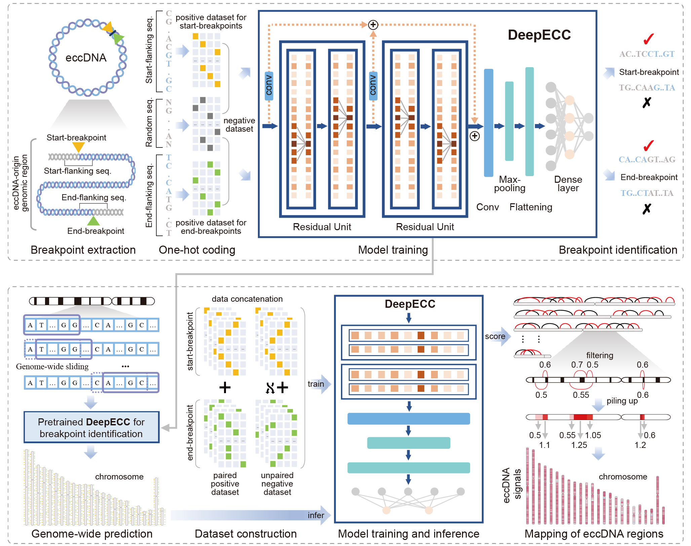

# DeepECC: A Deep Learning Framework for Whole-Genome Identification and Analysis of Human Cancer eccDNAs

## Usage
### Data preparation
Running the 'data_prepare.ipynb'

the main function is 

```
around_len = 1500
true_path = f'./data/cancer_cell_line_{around_len}.csv'
false_path = f'./data/cancer_cell_line_{around_len}_f.csv'
CCL_data = utils.data_preprocess(cancer_cell_line, genome_file, around_len=around_len)
false_data = utils.generate_false_data(CCL_data, around_len=around_len, multi_process=True, seed=42)
false_data = utils.data_preprocess(false_data, genome_file, around_len=around_len,read_data=False)

CCL_data.to_csv(true_path, header=True, index=None)
false_data.to_csv(false_path, header=True, index=None)
```

### Model evaluate
Running the 'model_evaluate.ipynb'

the main function is 

```angular2html
!python -m func.train_parallel_fold_valid \
    --pos_data {pos_data} \
    --neg_data {neg_data} \
    --start_end {start_end} \
    --seq_len {seq_len} \
    --parameter_choice {parameter_choice} \
    --epochs {epochs} \
    --lr {lr} \
    --wd {wd} \
    --dropout {dropout} \
    --batch_size {batch_size} \
    --smoothing {smoothing} \
    --threshold {threshold} \
    --val_split {val_split} \
    --save_path {save_path} \
    --dir_name {dir_name} \
    --world_size {world_size} \
    --device {device} \
    --show
```

### The first stage model training
Running the 'model_train_stage1.ipynb'

the main function is 
```angular2html
!python -m func.train_negative_reconstruction_parallel \
    --pos_data {pos_data} \
    --neg_data {neg_data} \
    --neg_file_list {neg_file_list} \
    --neg_threshold {neg_threshold} \
    --start_end {start_end} \
    --seq_len {seq_len} \
    --parameter_choice {parameter_choice} \
    --epochs {epochs} \
    --lr {lr} \
    --wd {wd} \
    --dropout {dropout} \
    --batch_size {batch_size} \
    --smoothing {smoothing} \
    --threshold {threshold} \
    --val_split {val_split} \
    --save_path {save_path} \
    --dir_name {dirname} \
    --world_size {world_size} \
    --device {device} \
    --show
```
### Whole genome breakpoints identification
Running the 'model_stage1_scan_genome.ipynb'
the main function is 
```angular2html
!python -m func.scan_genome \
    --genome_file {genome_file} \
    --parameter_path {parameter_path} \
    --parameter_choice {parameter_choice} \
    --start_end {start_end} \
    --dropout {dropout} \
    --seq_len {seq_len} \
    --batch_size {batch_size} \
    --threshold {threshold} \
    --chr {chr} \
    --num_workers {num_workers} \
    --save_path {save_path} \
    --dir_name {dir_name} \
    --device {device}
```
### The second stage model training

Running the 'model_train_stage2.ipynb'

the main function is 
```angular2html
!python -m func.train_parallel \
    --pos_data {pos_data} \
    --neg_data {neg_data} \
    --start_end {start_end} \
    --seq_len {seq_len} \
    --parameter_choice {parameter_choice} \
    --epochs {epochs} \
    --lr {lr} \
    --wd {wd} \
    --dropout {dropout} \
    --batch_size {batch_size} \
    --smoothing {smoothing} \
    --threshold {threshold} \
    --val_split {val_split} \
    --save_path {save_path} \
    --dir_name {dir_name} \
    --world_size {world_size} \
    --device {device} \
    --show \
    --joint
```
### The paired breakpoins identification
Running the 'model_stage2_score_genome.ipynb'

the main function is 
```angular2html
!python -m func.predict_joint \
    --joint_file {joint_file} \
    --genome_file {genome_file} \
    --parameter_path {parameter_path} \
    --chr {chr} \
    --joint_length {joint_length} \
    --batch_size {batch_size} \
    --save_path {save_path} \
    --dir_name {dir_name} \
    --parameter_choice {parameter_choice} \
    --dropout {dropout} \
    --device {device}
```
### Scoring the eccDNA regions
Running the 'generate_regions.ipynb'
